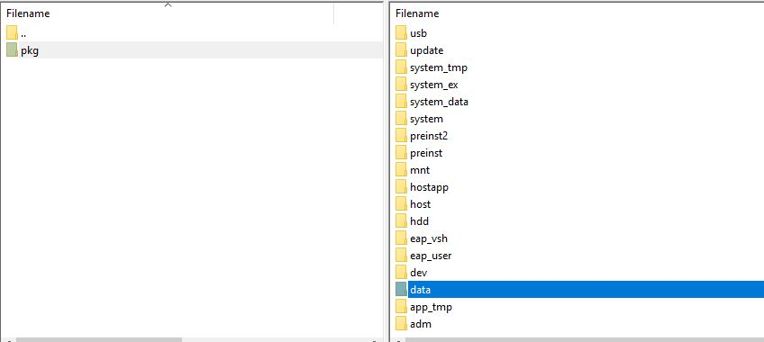

# How-To-Install-PS4-FPKGs
How To Install PS4 FPKG on Goldhen or ps4HEN    

# USB Method     
You can use any kind of USB drive or External USB HDD enclosure as long as it can run from the usb port and is formwatted in EXFAT   
1. Format your USB drive to EXFAT    
2. Place your fpkgs on the usb drive    
3. Follow one of my guides to jailbreak your console or use your own proccess     
[How to use a GUI tool to run PPPwn on Windows](https://github.com/DrYenyen/PPPwnGo-Guide)           
[How to set up Raspberry-Pi on Windows for PPPwn](https://github.com/DrYenyen/PPPwn-Setup-Guide-For-Raspberry-Pi)         
4. Go into Goldhen at the top left of the home screen    
5. Go into Debug Settings        
6. Go into Package Installer         
From there you can choose to install any 1 pkg you want or alternatively you will be automatically asked if you want to install all the available pkgs         

# FTP method PC to PS4 (fastest transfer speed)    
1. Follow one of my guides to jailbreak your console or use your own proccess        
[How to use a GUI tool to run PPPwn on Windows](https://github.com/DrYenyen/PPPwnGo-Guide)               
[How to set up Raspberry-Pi on Windows for PPPwn](https://github.com/DrYenyen/PPPwn-Setup-Guide-For-Raspberry-Pi)       
2. After Jailbreaking connect your PS4 to your home network over WiFi or Ethernet (WiFi and Ethernet Transfers with this method are significantly slower than direct PC to PS4 method above 
3. Create a folder called *pkg* and put your pkgs inside of it        
4. Connect your PS4 to your PC with a LAN cable 
5. On your PC go into Start>Settings>Network & Internet>Ethernet and then at the top right choose *Change Adapter Options*
6. Choose the ethernet Adapter you are using and right click on it then choose *properties*     
7. Double left click on *Internet Protocol Version 4 (TCP/IPv4)  #
   
8. Press on the empty circle next to *Use the following IP address:* to unlock the fields below    
   
9. Fill them in to match as shown below    
      

     
# FTP method over network to internal PS4 Storage    
1. Follow one of my guides to jailbreak your console or use your own proccess        
[How to use a GUI tool to run PPPwn on Windows](https://github.com/DrYenyen/PPPwnGo-Guide)               
[How to set up Raspberry-Pi on Windows for PPPwn](https://github.com/DrYenyen/PPPwn-Setup-Guide-For-Raspberry-Pi)       
2. After Jailbreaking connect your PS4 to your home network over WiFi or Ethernet (WiFi and Ethernet Transfers with this method are significantly slower than direct PC to PS4 method above 
3. Create a folder called *pkg* and put your pkgs inside of it        
4. Go into Goldhen at the top left of the home screen     
5. Go into *Server Settings*    
6. Enable the FTP server by making sure the box to the right of *Enabel FTP Server* is ticked      
7. Find your Console IP address by going into Settings>System>System Information  
8. Download and Install [Filezilla](https://filezilla-project.org/download.php?type=client)    
9. In Filezilla at *Host:* type your PS4 IP address and in *Port:* type 2121 then press on *Quickconnect* then press *OK* on the popup window    
10. On the left window of Filezilla go to where you made the folder *pkg* and drag and drop it to the right side window into the folder called *data*     
   
(In the future you can go into the *data* folder and drag directly into the *pkg* folder)
11. Go into Goldhen at the top left of the home screen        
12. Go into Debug Settings        
13. Under *Package Installer* change *Package Source* from usb[ usb:/ ] To Hdd [ hdd:/data/pkg/ ]   
14. Go into Package Installer             
From there you can choose to install any 1 pkg you want or alternatively you will be automatically asked if you want to install all the available pkgs     
